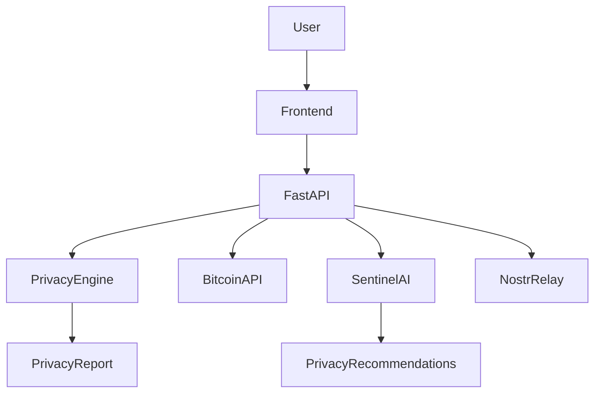

# Satoshi Sentinel 🛡️₿

**Your AI Guardian for Bitcoin Privacy.**

> *Understand your Bitcoin footprint before the world does.*

Satoshi Sentinel is an AI-powered Bitcoin privacy intelligence platform built for the **BOSS Battle Hackathon 2026** (Bitshala — themes: Bitcoin Privacy, Nostr, AI). It analyzes a Bitcoin address using public blockchain data (or realistic demo data), scores privacy risk transparently, explains everything in plain language via **Sentinel AI**, visualizes transaction relationships, and shares educational alerts over **Nostr** — all without ever touching private keys.

  

---

## 1. Problem statement

Bitcoin transactions are public by design, but most users don't understand:

- how addresses get linked together (clustering),
- why **address reuse** destroys privacy,
- how posting an address publicly exposes full history,
- how timing, amounts, and counterparties act as metadata,
- that centralized "privacy tools" can add new trust risks.

Existing explorers show raw data. They don't *explain* risk to normal humans.

## 2. Solution

Satoshi Sentinel combines **Bitcoin public data + AI reasoning + Nostr communication**:

| Pillar | What it does |
|---|---|
| 🔍 AI Privacy Risk Scanner | Scores any address 0–100 across reuse, counterparties, frequency, exposure, clustering |
| 🤖 Sentinel AI Copilot | Answers privacy questions for beginners, with honest uncertainty |
| 🕸️ Transaction Visualizer | Interactive React Flow graph, click any edge for an AI explanation |
| 💜 Nostr layer | Demo identity, relay status, community feed, educational alert publishing |
| 🎓 Privacy Academy | 9 lessons + score-improvement checklist with progress tracking |

## 3. Features

- Privacy score with count-up ring animation + risk-band badges
- Transparent per-category breakdown table
- Personalized recommendation engine
- 3 built-in demo wallets (scores 95 / 54 / 28)
- Live mode via mempool.space (optional, cached, graceful fallback)
- Gemini → OpenAI-compatible → **deterministic offline fallback** (demo never breaks)
- Nostr publish guard: refuses seeds / private keys / nsec
- Dark cyber-security UI, Framer Motion animations, responsive + mobile nav

## 4. Architecture



See [docs/architecture.md](docs/architecture.md) for details.

## 5. Technology stack

- **Frontend:** React 18, TypeScript, Vite, Tailwind CSS, Framer Motion, React Flow, lucide-react
- **Backend:** Python 3.11+, FastAPI, Pydantic v2, httpx, pytest
- **AI:** Google Gemini (optional) → OpenAI-compatible (optional) → local fallback
- **Bitcoin data:** mempool.space / Blockstream Esplora (optional; demo mode default)
- **Nostr:** demo relay status + local community feed (wss://relay.damus.io default)

## 6. Installation

**Prerequisites:** Python 3.11+, Node 18+.

```bash
# Backend
cd backend
pip install -r requirements.txt
uvicorn app.main:app --reload        # → http://localhost:8000

# Frontend (second terminal)
cd frontend
npm install
npm run dev                           # → http://localhost:5173
```

One-command demo:

```powershell
# Windows: double-click start.ps1 (or:)
powershell -ExecutionPolicy Bypass -File start.ps1
# macOS/Linux:
bash start.sh
```

This opens two server windows (backend :8000, frontend :5173) and launches the browser. Keep both windows open. Manual alternative:

## 7. Environment variables

Copy `.env.example` → `backend/.env` (everything optional — demo works with none):

| Var | Purpose | Default |
|---|---|---|
| `GEMINI_API_KEY` | Live Sentinel AI via Gemini | "" (fallback mode) |
| `OPENAI_API_KEY` / `OPENAI_BASE_URL` | OpenAI-compatible fallback | "" |
| `BITCOIN_MODE` | `demo` or `live` default | demo |
| `NOSTR_DEFAULT_RELAY` | Displayed relay | wss://relay.damus.io |
| `CORS_ORIGINS` | Allowed frontend origins | localhost:5173,3000 |

## 8. Demo instructions (judges: 30 seconds to value)

1. `npm run dev` + backend running → landing page.
2. Click **Scan a Wallet** → demo address prefilled → **Analyze Privacy**.
3. Watch the scan animation → score ring (try Exposed wallet = 28/100).
4. Open **Sentinel AI** → ask *"Why is address reuse a privacy problem?"*
5. Click a graph edge → AI explains the transaction.
6. Open **Nostr Network** → generate identity → publish a tip.

Full 3-minute script: [docs/demo-script.md](docs/demo-script.md).

## 9. Screenshots

> `assets/` placeholders — capture: (1) landing hero, (2) scan report with score ring, (3) transaction graph, (4) Sentinel AI chat, (5) Nostr feed.

## 10. Privacy & security principles

- ⛔ Never requests seed phrases, private keys, or exchange passwords
- ⛔ Never executes transactions or moves funds (read-only analysis)
- ⛔ Never claims to identify owners or accuses anyone of crimes
- ✅ Score labeled as an **educational estimate**, with visible disclaimer
- ✅ Nostr layer refuses to publish anything resembling keys

## 11. API reference (brief)

| Endpoint | Method | Body |
|---|---|---|
| `/api/scan` | POST | `{address, mode}` → score, categories, recs, graph |
| `/api/scan/demos` | GET | demo wallet list |
| `/api/chat` | POST | `{message, context}` → answer + provider |
| `/api/explain` | POST | `{tx, wallet_address}` → plain-language explanation |
| `/api/nostr/status|identity|feed` | GET | relay + community posts |
| `/api/nostr/publish` | POST | `{content, author}` (280 chars, key-guarded) |
| `/api/health` | GET | liveness |

## 12. Testing

```bash
cd backend && python -m pytest tests -q   # 11 tests: scoring, reuse, endpoints, AI fallback, Nostr safety
cd ../frontend && npm run build            # tsc + vite production build
```

## 13. Deployment

- Frontend → Vercel (`frontend/dist`, proxy `/api` to backend URL in production)
- Backend → Render / Railway / Fly.io (`uvicorn app.main:app --host 0.0.0.0 --port $PORT`)
- DB → SQLite for demo (no persistent PII stored)

## 14. Future roadmap

- Real Nostr relay publish via `nostr-tools` + NIP-07 signing
- PSBT/`.xpub`-free descriptor import (watch-only, still no keys)
- Coin-control simulator ("what if I consolidate these UTXOs?")
- Multi-address wallet clustering view + Lightning channel privacy overlay
- Hindi/other-language Academy tracks

## 15. Hackathon

- **Event:** BOSS Battle Hackathon 2026 · Bitshala · deadline Oct 5, 2026
- **Themes:** Bitcoin Privacy · Nostr · AI — this project integrates all three genuinely
- **Team size:** 1–3 · open source · MIT

---

*Satoshi Sentinel is an educational privacy analysis tool. It does not identify wallet owners and does not provide financial or legal advice.*
