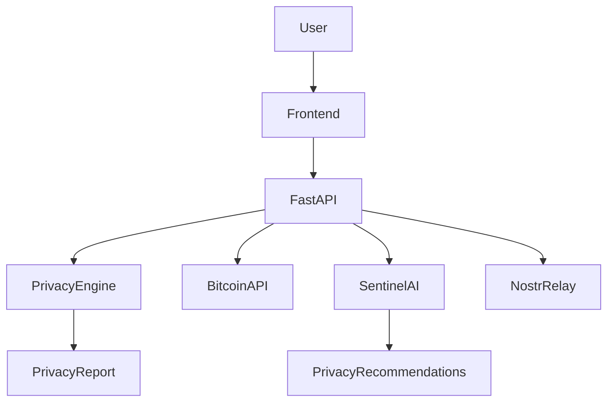

# Satoshi Sentinel architecture

## Request flows

**Scan:** `Scanner.tsx → POST /api/scan → bitcoin_service (demo/live) → privacy_engine.analyze_wallet → build_recommendations → ScanResult → score ring + tables + TxGraph`.

**Chat:** `SentinelChat.tsx → POST /api/chat → ai_service.ask_sentinel (Gemini → OpenAI → local KB fallback)`.

**Explain:** graph edge click → `POST /api/explain` → plain-language summary with uncertainty language.

**Nostr:** `NostrNet.tsx → GET /api/nostr/*` (status/identity/feed), `POST /api/nostr/publish` (280-char, refuses key-like content).

## Scoring weights

reuse 30% · counterparties 20% · exposure 20% · frequency 15% · clustering 15%. Bands: ≥70 low risk, 45–69 medium, <45 high. Deterministic and covered by `tests/test_sentinel.py` (ordering invariant: beginner > active > exposed).

## Trust boundaries

No private keys, seeds, or passwords ever enter the system. Live Bitcoin reads use keyless public APIs with graceful demo fallback. Nostr publish path has a blocklist (`seed`, `private key`, `nsec1`).
